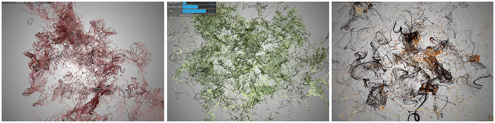
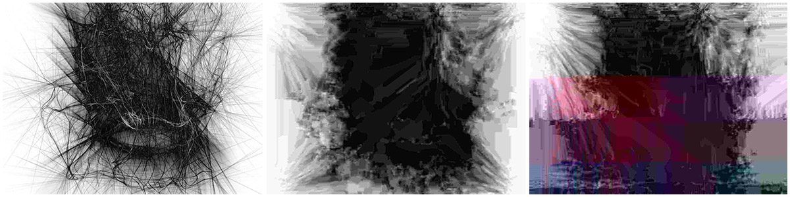
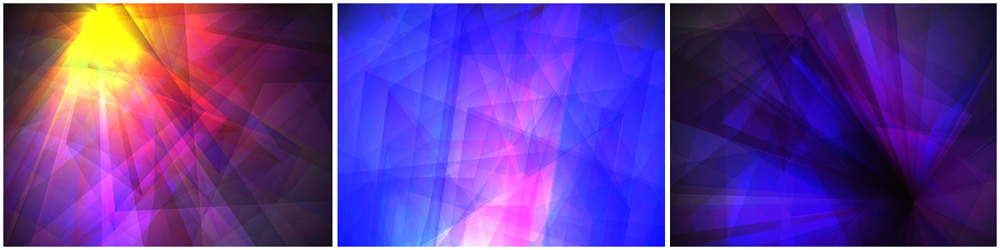
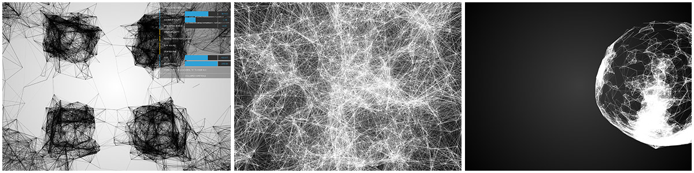
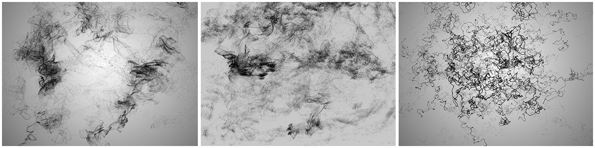
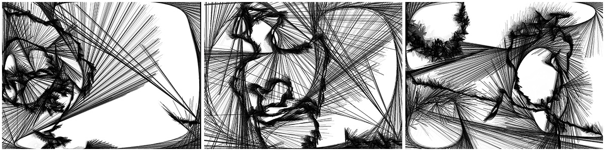
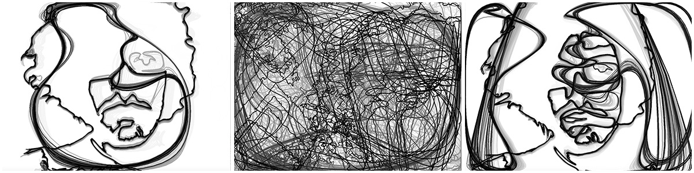

# OpenFrameworks Experiments 2015

#### Work Created at SAIC to learn OF

##### camColNoiseParticles - Take color input from Camera

##### imageCompression - Compress/Glitch JPEG

##### meshAudio - audio-reactive Rotating Mesh with blendmodes

##### meshCam - abstracted 3D mesh from camera

##### midtermWithScale - sound responsive particle web

##### NoiseParticles - perlin noise experiment

##### PolyCamExtendLines - PolyLine contour mapping with camera input

##### PolyCam

## To Run them:
 You need to download OpenFrameworks 0.9.0: http://openframeworks.cc/download/ - (the nightly builds at the bottom) - then put the programs in of/apps/myApps and use the project generator to build them for your IDE.
